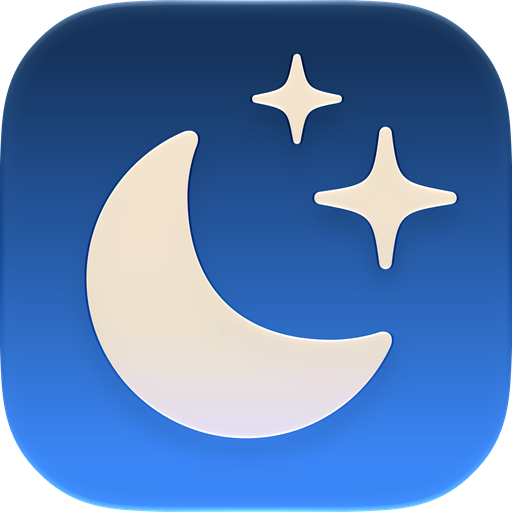

# Darko 🌓

A lightweight macOS menu bar app that toggles Light/Dark mode — manually, on a schedule, or with a global keyboard shortcut.

<p align="center">
  
</p>

Darko is a pure AppKit app (no SwiftUI) built with Swift Package Manager. It runs entirely in the menu bar — no Dock icon.

## Features

- **Quick toggle** — flip Light/Dark mode straight from the menu bar
- **Auto mode** — schedule dark mode between specific hours (handles ranges that cross midnight, re-arms on wake)
- **Global keyboard shortcut** — set your own combo (e.g. `⌘⇧L`) to toggle dark mode from any app
- **Launch at login** — start Darko automatically when you log in
- **Live sync** — the icon stays in sync with appearance changes made outside the app

## Requirements

- macOS 14 (Sonoma) or later
- Swift toolchain (Command Line Tools or Xcode)

## Build & run

```sh
./build.sh        # compiles and packages dist/Darko.app
open dist/Darko.app
```

No third-party dependencies — only the macOS SDK.

## Usage

Click the Darko icon in the menu bar to open the panel:

- **Switch to Dark / Switch to Light** — toggle the system appearance
- **Auto mode** — enable the schedule; pick the start and end times
- **Keyboard shortcut** — click the shortcut box, then press your desired combo. A modifier key (⌃⌥⌘⇧) is required. Press `Esc` to cancel recording, or click ✕ to remove the shortcut
- **Launch at login** — register the app as a login item

## Permissions

On first use, macOS asks for **Automation** permission to control *System Events* — this is what lets Darko change the system appearance. If no prompt appears, grant it in **System Settings → Privacy & Security → Automation**.

> Note: "Launch at login" requires the app to be code-signed and placed in `/Applications` (ad-hoc signed builds run from a custom location may not register).

## Project layout

```
Sources/Darko/
  main.swift                  App entry point
  AppDelegate.swift           Status item + popover
  AppearanceController.swift  Appearance state, schedule timers, wake handling
  HotkeyManager.swift         Carbon global hotkey + shortcut recording
  AppleScriptManager.swift    System appearance read/write
  ContentViewController.swift Popover UI (AppKit)
  Notifications.swift         Internal notifications
```

## License

MIT
